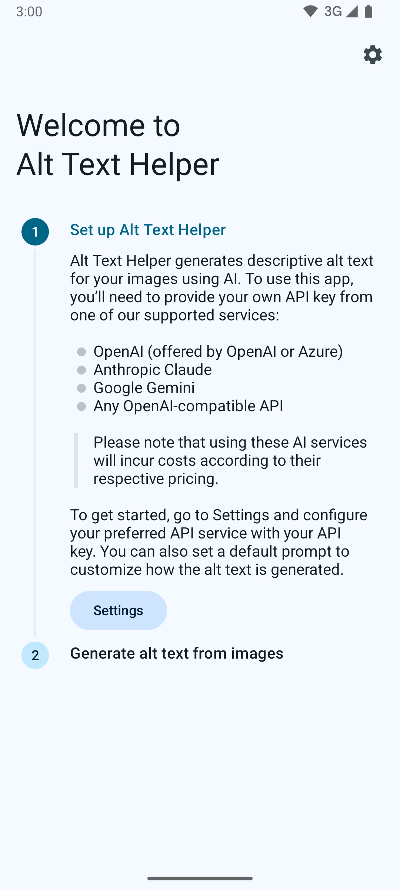
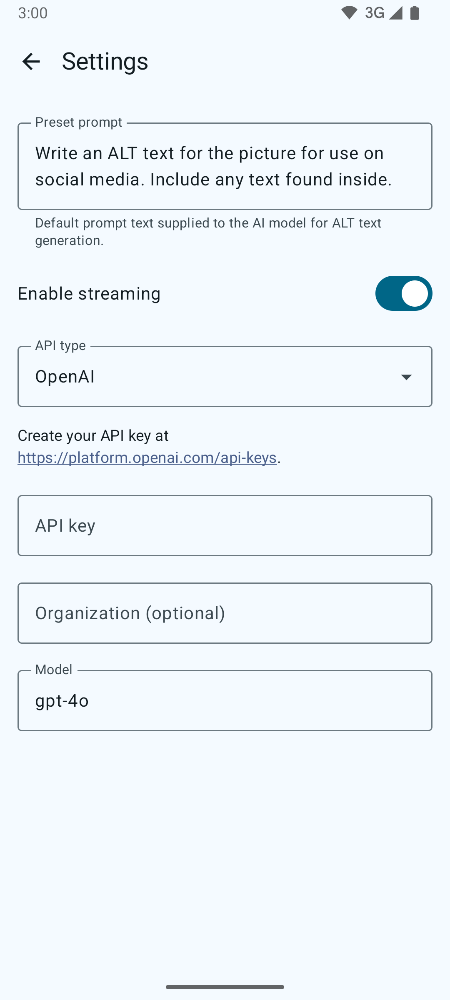
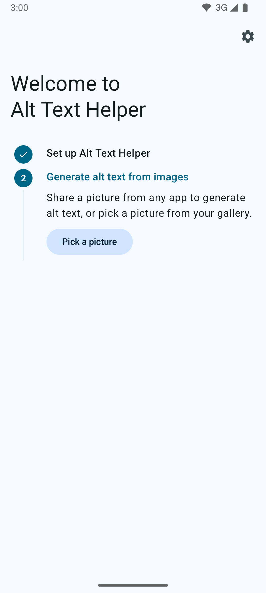
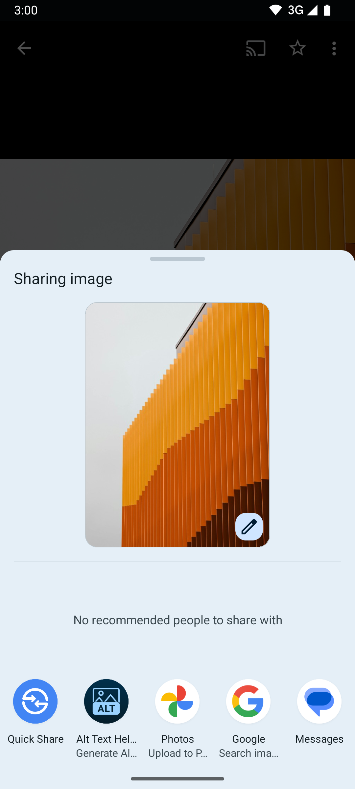
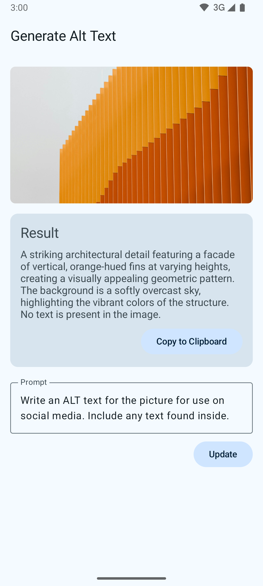

# Alt Text Helper

Generate accurate and detailed alt text for your images using advanced AI technology. Perfect for social media managers, content creators, and accessibility advocates who want to make their content more inclusive.

|  |  |  |  |  |
|:--:|:--:|:--:|:--:|:--:|

## Key Features

- **Powered by Leading AI Models** – Choose from OpenAI, Azure OpenAI, Anthropic Claude, Google Gemini, or any OpenAI-compatible API
- **Seamless Integration** – Share images directly from any app or select from your gallery
- **Customizable Prompts** – Fine-tune the AI’s description style with custom prompts

## Perfect for

- Social media posts
- Blog articles
- Website content
- Digital marketing materials
- Educational resources
- Accessibility compliance

> [!NOTE]
> This app requires an API key from one of the supported AI services (OpenAI, Azure OpenAI, Anthropic Claude, Google Gemini, or other OpenAI-compatible providers). API usage may incur costs according to the service provider’s pricing.

Make your content more accessible today with Alt Text Helper – the smart way to generate image descriptions.

## Join beta test

* Visit https://groups.google.com/g/1a23-apk-closed-testing and join the group with your Google account
* Visit https://play.google.com/apps/testing/studio1a23.altTextAi, log in with the same Google account and click “Join the program”
* Visit [AI Text Helper – Apps on Google Play](https://play.google.com/apps/testing/studio1a23.altTextAi) to install the app to your watch.

## License

```
Alt Text Helper: AI-Powered Image Descriptions.
Copyright (C) 2024 Eana Hufwe

This program is free software: you can redistribute it and/or modify
it under the terms of the GNU General Public License as published by
the Free Software Foundation, either version 3 of the License, or
(at your option) any later version.

This program is distributed in the hope that it will be useful,
but WITHOUT ANY WARRANTY; without even the implied warranty of
MERCHANTABILITY or FITNESS FOR A PARTICULAR PURPOSE.  See the
GNU General Public License for more details.

You should have received a copy of the GNU General Public License
along with this program.  If not, see <http://www.gnu.org/licenses/>.
```
